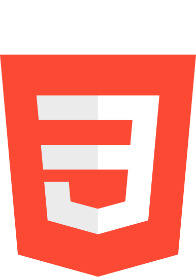
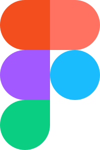

  <h1>
    
    Gustavo Henrique de Oliveira Gonçalves
  </h1>
  <h4>
    <code>&nbsp;Desenvolvedor Front-End&nbsp;</code>
  </h4>
  
Estudante do 3º ano de Desenvolvimento de Sistemas na ETEC Ilza Nascimento Pintus, em São Paulo. Com 18 anos, me dedico ao <b>aperfeiçoamento pessoal, arquitetura de dados e tecnologias Fullstack</b>. Minha filosofia de trabalho integra estética e funcionalidade, enxergando o desenvolvimento de software como uma forma de <b>expressão técnica</b> dotada de <b>valor emocional e artístico.</b>

  <h2>
    
    Projetos
  </h2>
  <h3>ETEC</h3>
  <a href="https://github.com/guskka/PWIII">PWIII</a>
Repositório com todos os projetos desenvolvidos em 2026 no módulo Programação Web 3 na ETEC Ilza Nascimento Pintus

  <h2>
    
    Meu Workspace
  </h2>
  

    <h3>IDE (Editor de Código)</h3>
    
  

  

    <h3>Technical Stack (Linguagens)</h3>
    
    &nbsp;
    
    &nbsp;
    
    &nbsp;
    
  

  

    <h3>Development Tools (Ferramentas)</h3>
    
    &nbsp;
    
  

  <h2>
    
    Outros
  </h2>
  <!-- 
   -->

