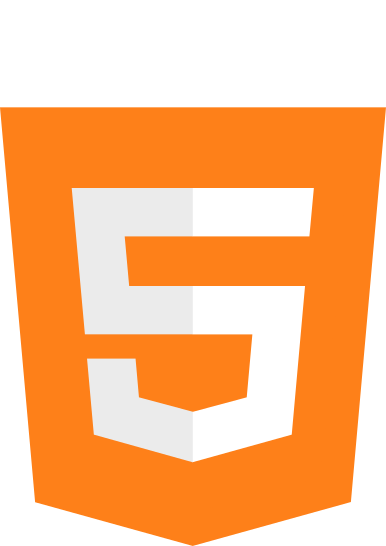
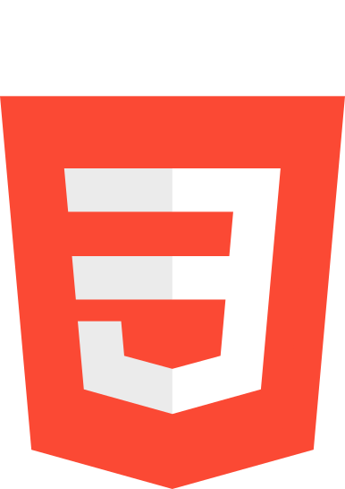
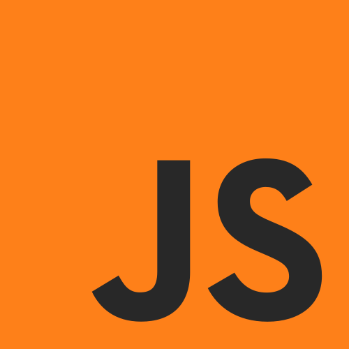
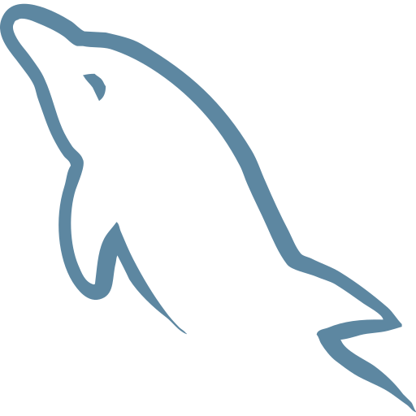
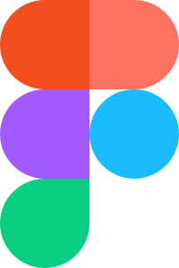

  <h3 align="center">Gustavo Henrique de Oliveira Gonçalves</h3>
  <h4 align="center">
    <code>&nbsp;Frontend Dev&nbsp;</code>
  </h4>

  <h2 align="center">
    
    Tech Stack
  </h2>
  

    <h3>Languages & Frameworks </h3>
    
    &nbsp;
    
    &nbsp;
    
    &nbsp;
    
    &nbsp;
    
    &nbsp;
    
    &nbsp;
    
    &nbsp;
    
  

  

    <h3>Tools</h3>
    
    &nbsp;
    
    &nbsp;
    
    &nbsp;
    
    
  

  <h2>
    
    Projects
  </h2>
    
  
Inventory management system for Curso Alberto Santos Dumont (CASD)

  <small><code>React • Tailwind • Nodejs • Vite • MySQL (in development)</code></small>

